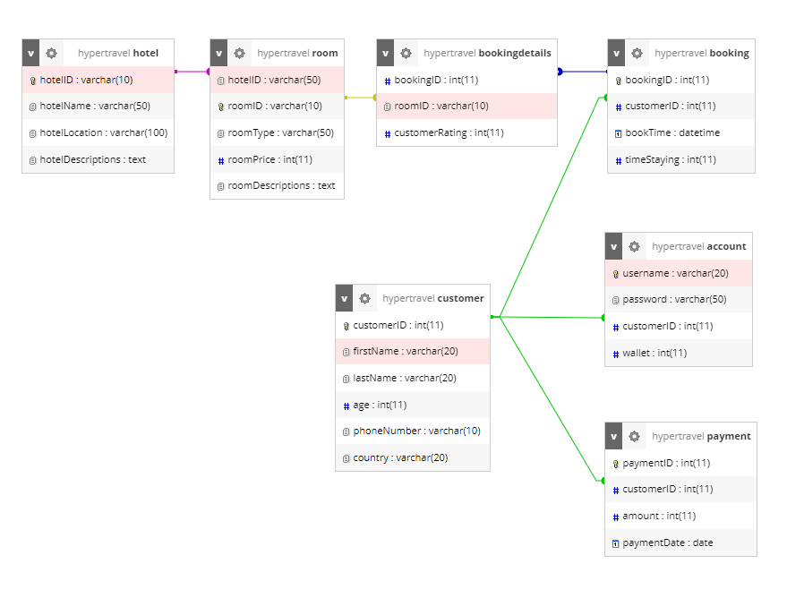

# HyperTravel

HyperTravel is a Vietnamese accommodations booking website that can help you quickly plan your perfect trip on any budget.

This is a group project for INT2211 4 class - Database.

## Team Members

| Name           | Student ID |
| -------------- | ---------- |
| Ngo Tuan Minh  | 20020059   |
| Hoang Viet Hai | 20020049   |
| Mai Tuan Nghia | 20020262   |

# Functionality

## Database Design

**_DISCLAIMER: This ER-diagram is subject to change, and should not be used as a representation of what the actual database looks like._**

## Finished

## To-do

-
-   Integrate with flights API (maybe [_Skyscanner_](https://www.skyscanner.com.vn/), [_Amadeus_](https://developers.amadeus.com/)).

# Credit

-   Idea based on [_Traveloka_](https://www.traveloka.com/vi-vn/) and [_Booking.com_](https://www.booking.com/index.vi.html).
-
